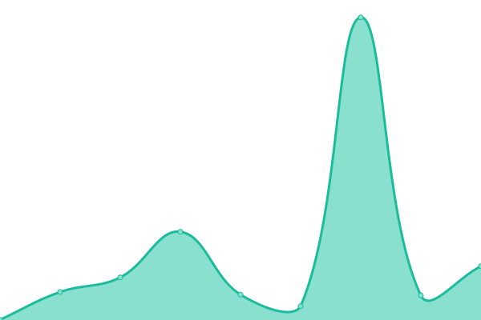
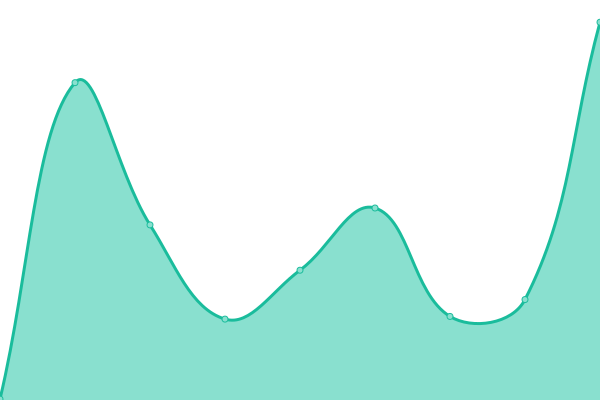

# [📈 Live Status](https://status.sistem.teknologipendidikan.or.id): <!--live status--> **🟩 All systems operational**

This repository contains the open-source uptime monitor and status page for [Teknologi Pendidikan](https://teknologipendidikan.or.id), powered by [Upptime](https://github.com/upptime/upptime).

With [Upptime](https://upptime.js.org), you can get your own unlimited and free uptime monitor and status page, powered entirely by a GitHub repository. We use [Issues](https://github.com/teknologi-pendidikan/uptime-robot/issues) as incident reports, [Actions](https://github.com/teknologi-pendidikan/uptime-robot/actions) as uptime monitors, and [Pages](https://status.sistem.teknologipendidikan.or.id) for the status page.

<!--start: status pages-->
<!-- This summary is generated by Upptime (https://github.com/upptime/upptime) -->
<!-- Do not edit this manually, your changes will be overwritten -->
<!-- prettier-ignore -->
| URL | Status | History | Response Time | Uptime |
| --- | ------ | ------- | ------------- | ------ |
|  [Main Sites](https://teknologipendidikan.or.id) | 🟩 Up | [main-sites.yml](https://github.com/teknologi-pendidikan/uptime-robot/commits/HEAD/history/main-sites.yml) | 

 362ms
     
 | 

<a href="https://status.sistem.teknologipendidikan.or.id/history/main-sites">99.76%</a>
    

|  [LOFI-TEP](https://lofi.um.teknologipendidikan.or.id) | 🟩 Up | [lofi-tep.yml](https://github.com/teknologi-pendidikan/uptime-robot/commits/HEAD/history/lofi-tep.yml) | 

 205ms
     
 | 

<a href="https://status.sistem.teknologipendidikan.or.id/history/lofi-tep">99.76%</a>
    

|  [Hima UM](https://hima.um.teknologipendidikan.or.id) | 🟩 Up | [hima-um.yml](https://github.com/teknologi-pendidikan/uptime-robot/commits/HEAD/history/hima-um.yml) | 

 407ms
     
 | 

<a href="https://status.sistem.teknologipendidikan.or.id/history/hima-um">99.77%</a>
    

|  [Status Page](https://teknologi-pendidikan.github.io/uptime-robot/) | 🟩 Up | [status-page.yml](https://github.com/teknologi-pendidikan/uptime-robot/commits/HEAD/history/status-page.yml) | 

 190ms
     
 | 

<a href="https://status.sistem.teknologipendidikan.or.id/history/status-page">100.00%</a>
    

<!--end: status pages-->

[**Visit our status website →**](https://status.sistem.teknologipendidikan.or.id)

## 📄 License

- Powered by: [Upptime](https://github.com/upptime/upptime)
- Code: [MIT](./LICENSE) © [Teknologi Pendidikan](https://teknologipendidikan.or.id)
- Data in the `./history` directory: [Open Database License](https://opendatacommons.org/licenses/odbl/1-0/)
